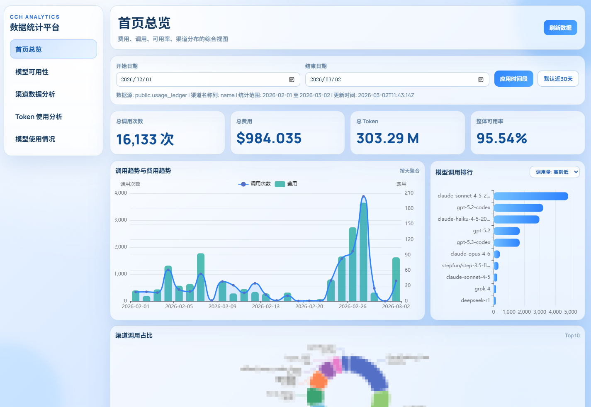
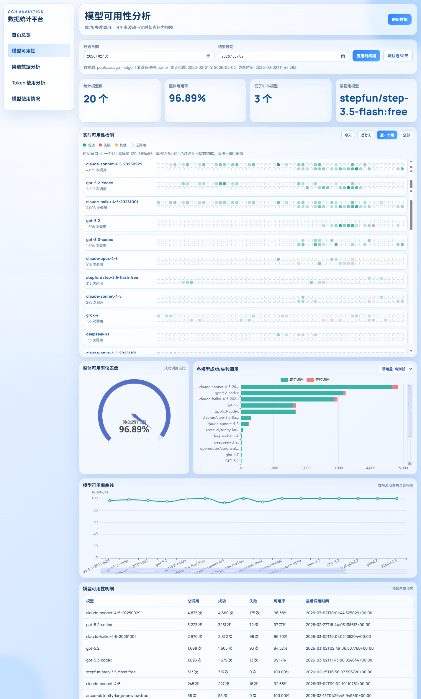
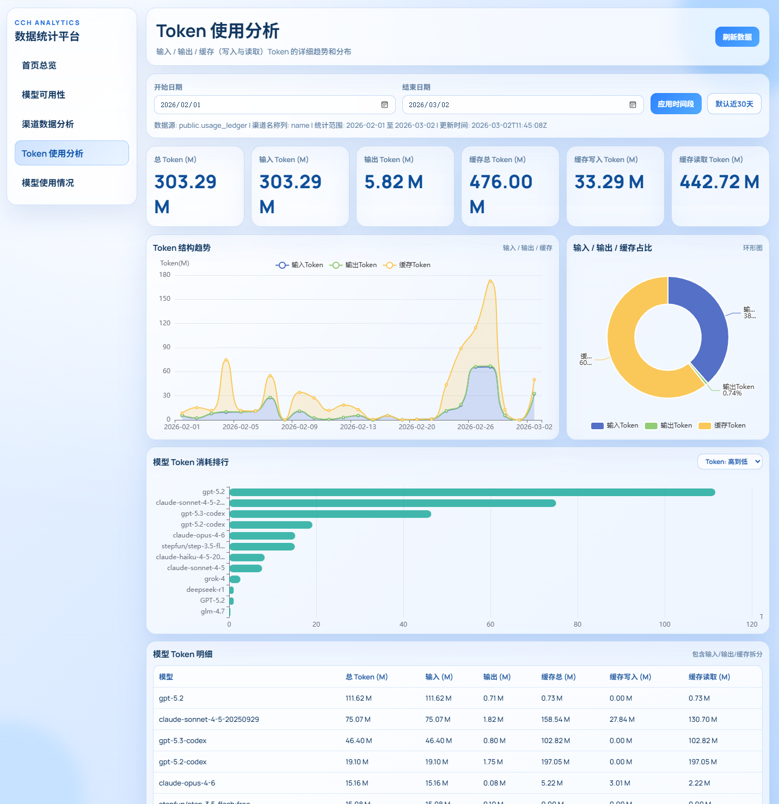
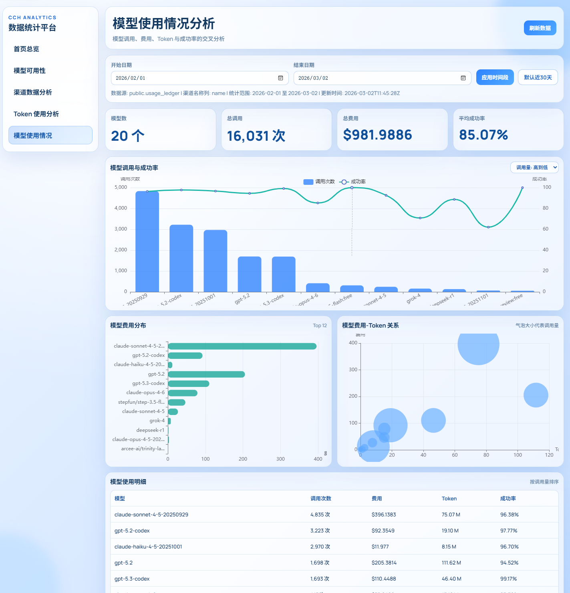

# CCH Stats Dashboard










FastAPI + PostgreSQL 的数据统计网站，支持：
- 费用统计
- 模型统计
- 调用趋势统计
- 模型可用性统计
- 渠道（供应商）调用统计
- Token 使用统计

所有统计维度都带缓存 TTL，避免高频打库。数据库连接、刷新频率、时间窗口都在 `.env` 配置。

## 功能

- 自动识别日志表和常见字段（时间、模型、渠道、费用、Token、状态、错误等）。
- 多页面可视化：
- `/` 首页总览
- `/availability` 模型可用性
- `/channels` 渠道数据分析
- `/tokens` Token 使用分析
- `/keys` Key 聚合分析页（支持多选 key 聚合展示）
- `/keys/{key_slug}` Key 专属分析页（自动预选该 key）
- `/models` 模型使用分析
- ECharts 现代图表（仪表盘、Treemap、散点、混合图、排行图）。
- 柱状图支持排序切换（默认从高到低，可切换从低到高）。
- 模型可用性页面含“实时可用性检测”方格板块（今天/近七天/近一个月/全部）。
- Docker 一键部署。

## 环境变量

可复制 `.env.example` 为 `.env` 后按需修改。以下是每个配置项的中文说明：

| 配置项 | 默认值 | 中文说明 |
| --- | --- | --- |
| `APP_NAME` | `CCH Stats Dashboard` | 应用名称，用于页面标题和服务标识。 |
| `DATABASE_DSN` | 无（必填） | PostgreSQL 连接串，格式 `postgres://用户名:密码@主机:端口/数据库名`。 |
| `HISTORY_DAYS` | `30` | 默认统计历史天数（未传时间参数时使用）。 |
| `MAX_RANGE_DAYS` | `180` | API 允许查询的最大时间跨度（天）。 |
| `DB_POOL_MIN_SIZE` | `1` | 数据库连接池最小连接数。 |
| `DB_POOL_MAX_SIZE` | `8` | 数据库连接池最大连接数。 |
| `SCHEMA_REFRESH_SECONDS` | `1800` | 表结构缓存刷新间隔（秒）。 |
| `REFRESH_COST_SECONDS` | `900` | 费用统计缓存刷新间隔（秒）。 |
| `REFRESH_MODEL_SECONDS` | `900` | 模型统计缓存刷新间隔（秒）。 |
| `REFRESH_CALL_SECONDS` | `900` | 调用趋势统计缓存刷新间隔（秒）。 |
| `REFRESH_AVAILABILITY_SECONDS` | `900` | 可用性统计缓存刷新间隔（秒）。 |
| `REFRESH_REALTIME_AVAILABILITY_SECONDS` | `900` | 实时可用性统计缓存刷新间隔（秒）。 |
| `REFRESH_CHANNEL_SECONDS` | `900` | 渠道统计缓存刷新间隔（秒）。 |
| `REFRESH_TOKEN_SECONDS` | `900` | Token 统计缓存刷新间隔（秒）。 |
| `REFRESH_API_ENABLED` | `false` | 是否启用全量刷新接口（默认关闭）。 |
| `REFRESH_API_AUTH_KEY` | 空 | 全量刷新接口鉴权 key，仅在启用刷新接口时生效。 |
| `CHANNEL_NAME_COLUMN_OVERRIDE` | 空 | 强制指定“渠道名称字段名”，留空则自动识别。 |
| `CHANNEL_ID_COLUMN_OVERRIDE` | 空 | 强制指定“渠道 ID 字段名”，留空则自动识别。 |
| `CHANNEL_LOOKUP_TABLE_OVERRIDE` | 空 | 强制指定渠道字典表名，留空则自动识别。 |
| `CHANNEL_LOOKUP_ID_COLUMN_OVERRIDE` | 空 | 强制指定渠道字典表 ID 字段名，留空则自动识别。 |
| `CHANNEL_LOOKUP_NAME_COLUMN_OVERRIDE` | 空 | 强制指定渠道字典表名称字段名，留空则自动识别。 |
| `KEY_COLUMN_OVERRIDE` | 空 | 强制指定“调用 key 字段名”，留空则自动识别（如 `api_key`/`token`）。 |
| `KEY_RECORDS_LIMIT` | `100` | Key 专属页面使用记录最大返回条数。 |
| `KEY_RECORDS_DEFAULT_PAGE_SIZE` | `10` | Key 页面记录表默认每页条数。 |
| `KEY_RECORDS_MAX_PAGE_SIZE` | `100` | Key 页面记录表每页条数上限。 |
| `KEY_VISUAL_REFRESH_SECONDS` | `30` | Key 页面独立自动刷新间隔（秒）。 |
| `KEY_VISUAL_AUTO_REFRESH_ENABLED` | `false` | Key 页面是否默认开启自动刷新（默认关闭）。 |
| `KEY_CONFIGS` | 空 | 配置 Key 菜单与匹配值，格式 `名称|key值;名称2|key值2`。 |
| `REALTIME_AVAILABILITY_MODEL_LIMIT` | `30` | 实时可用性接口返回的模型数量上限。 |
| `REALTIME_AVAILABILITY_EVENT_LIMIT` | `120` | 实时可用性接口返回的事件数量上限。 |
| `REALTIME_AVAILABILITY_ALL_MAX_DAYS` | `120` | `window=all` 时允许查询的最大天数。 |
| `CORS_ORIGINS` | `*` | CORS 允许来源；多个来源用英文逗号分隔。 |

`KEY_CONFIGS` 示例：

```env
KEY_CONFIGS=默认Key|sk-xxxxx;运营Key|sk-yyyyy
```

`GET /api/config/keys` 同时返回 Key 页面可视化配置（自动刷新间隔、分页默认值、分页上限）。

全量刷新接口配置示例（默认关闭）：

```env
REFRESH_API_ENABLED=true
REFRESH_API_AUTH_KEY=replace-with-your-secret-key
```

调用方式（命中后会清空缓存并预热主要统计数据）：

```bash
curl -X POST "http://localhost:8000/api/admin/refresh-all" \
  -H "X-Refresh-Key: replace-with-your-secret-key"
```

也支持 Query 参数：

```bash
curl -X POST "http://localhost:8000/api/admin/refresh-all?refresh_key=replace-with-your-secret-key"
```

渠道映射逻辑：
- 优先直接使用渠道名称列。
- 若只有渠道 ID，优先尝试外键映射到字典表名称。
- 无外键时，会启发式匹配 `provider/channel/vendor/supplier` 字典表。
- 仍无法映射时归并为“未知渠道”，不会直接展示 ID。

## 本地运行

```bash
python -m venv .venv
source .venv/bin/activate  # Windows: .venv\Scripts\activate
pip install -r requirements.txt
uvicorn app.main:app --reload --host 0.0.0.0 --port 8000
```

打开 `http://localhost:8000`。

## Docker 部署

### 方式一：基于 Docker Hub 镜像（docker run）

1. 准备环境变量文件：

```bash
cp .env.example .env
# 编辑 .env，至少配置 DATABASE_DSN
```

2. 拉取镜像：

```bash
docker pull xrilang/cch-data-i-know:latest
```

3. 启动容器：

```bash
docker run -d \
  --name cch-stats-dashboard \
  --env-file .env \
  -p 8000:8000 \
  --restart unless-stopped \
  xrilang/cch-data-i-know:latest
```

### 方式二：基于 Docker Hub 镜像（docker compose）

1. 准备环境变量文件：

```bash
cp .env.example .env
# 编辑 .env，至少配置 DATABASE_DSN
```

2. 新建 `docker-compose.hub.yml`：

```yaml
services:
  cch-stats-dashboard:
    image: xrilang/cch-data-i-know:latest
    container_name: cch-stats-dashboard
    env_file:
      - .env
    ports:
      - "8000:8000"
    restart: unless-stopped
```

3. 启动服务：

```bash
docker compose -f docker-compose.hub.yml up -d
```

4. 查看状态与日志：

```bash
docker compose -f docker-compose.hub.yml ps
docker compose -f docker-compose.hub.yml logs -f
```

打开 `http://localhost:8000`。

### 方式三：本地源码构建镜像（可选）

```bash
docker compose up -d --build
```

## API

- `GET /healthz`
- `GET /api/dashboard`
- `GET /api/stats/cost`
- `GET /api/stats/model`
- `GET /api/stats/call-trend`
- `GET /api/stats/availability`
- `GET /api/stats/channel`
- `GET /api/stats/token`
- `GET /api/config/keys`
- `GET /api/stats/keys?slugs=slug1,slug2&records_page=1&records_page_size=20`
- `GET /api/stats/key/{key_slug}?records_page=1&records_page_size=20`
- `GET /api/stats/realtime-availability?window=today|7d|30d|all`
- `POST /api/admin/refresh-all`（需在 `.env` 启用并携带刷新授权 key）

说明：
- `window=all` 时按“天”聚合，每个方格固定代表 1 天，最多查询最近 `REALTIME_AVAILABILITY_ALL_MAX_DAYS` 天（默认 120 天）。

通用时间参数（统计 API 支持）：
- `start_date=YYYY-MM-DD`
- `end_date=YYYY-MM-DD`
